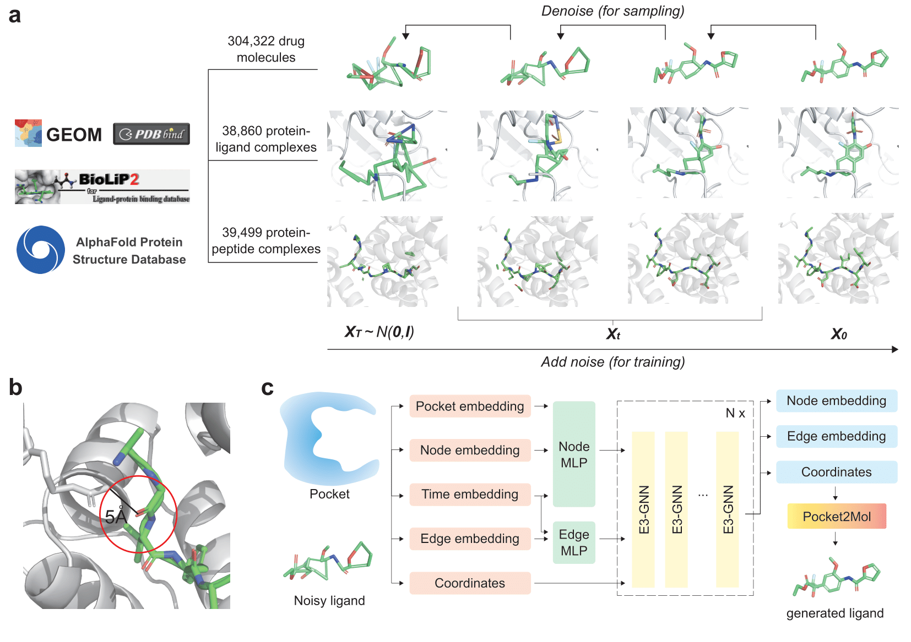

# Peptide2Mol: A Diffusion Model for Transforming Peptide Binders into Small Molecules

**Peptide2Mol** is a diffusion-based method for generating small-molecule candidates from peptide binders in drug design.  
This repository provides the necessary code, instructions, and model weights for inference or retraining.  
For any questions or issues, feel free to [open an issue](https://github.com/BLUE-Flowing/Peptide2Mol/issues) or reach out via email at [he-xinheng@foxmail.com](mailto:he-xinheng@foxmail.com).

<p align="center">
  
</p>

<p align="center">
  </b> Overview of the Peptide2Mol diffusion-based framework.
</p>

---
## Quick Links

- [Setup Environment](#setup-environment)
- [Dataset (Optional)](#optional-dataset)
  - [Downloading](#downloading)
  - [Preprocessing](#preprocessing)
- [Training Weights](#training-weights)
- [Data Preparation](#data-preparation)
  - [Step1 Prepare Protein Inputs](#step-1-prepare-protein-inputs)
  - [Step2 Generate .pt Files](#step-2-generate-pt-files)
- [Inference](#inference)
  - [Step3 Demo Generation](#step-3-demo-generation)
- [Step4 Fix Molecules with Pocket2Mol (Optional)](#optional-step-4-fix-molecules-with-pocket2mol)
- [Retraining Peptide2Mol](#retraining-peptide2mol)
- [License](#license)
---

## Setup Environment

Follow these steps to set up an Anaconda environment for running Peptide2Mol. Ensure compatibility by installing the specified versions of **PyTorch, PyTorch-Geometric, CUDA (if applicable)**, and other dependencies:

```bash
git clone https://github.com/BLUE-Flowing/Peptide2Mol.git
cd Peptide2Mol

conda create --name peptide2mol python=3.9.19
conda activate peptide2mol

pip install torch==2.2.2 torchvision==0.17.2 torchaudio==2.2.2
pip install hydra-core==1.3.2 hydra-colorlog==1.2.0 hydra-optuna-sweeper==1.2.0 rootutils==1.0.7 pre-commit==3.7.0 rich==13.7.1 pytest==8.1.1
pip install lightning==2.2.2
pip install numpy==1.22.4
pip install pandas==2.2.2
pip install lmdb==1.4.1
pip install rdkit==2023.9.6
pip install torch-geometric==2.5.2
pip install numba==0.59.1
pip install torch_scatter torch_sparse torch_cluster torch_spline_conv -f https://data.pyg.org/whl/torch-2.2.2+cu121.html
pip install easydict==1.13
pip install tensorboard==2.16.2
pip install Bio==1.6.2
```

> **Note:** Installation may take up to one hour on a typical Linux machine.

---

## (Optional) Dataset

### Downloading
To train the **Peptide2Mol** model from scratch, you can download the original dataset from **Google Drive**:
[Download the dataset (Drive folder)](https://drive.google.com/drive/folders/1I2uyFPSfeDS1ZXzKxw4ZQ5cu74sQGtSD?hl=zh)

After downloading, you should have the following files:
- **dataset.tar.gz** —— compressed dataset containing structure files
- **final_csv_goodH.csv** —— CSV file containing metadata and diffusion indices

Place both files into the **Peptide2Mol/** directory and then extract the dataset:
```bash
mkdir -p dataset
tar -xzvf dataset.tar.gz -C dataset
mv final_csv_goodH.csv dataset/
```

### Preprocessing
After downloading and extracting the dataset into the **`dataset/`** folder, run the preprocessing script to convert the SDF files into PyTorch `.pt` files for model training:
```bash
python ./notebooks/deal_with_mol_5A.py \
       ./dataset/final_csv_goodH.csv \
       ./dataset/sdf_noH \
       ./dataset/data.pt
```
Then, the processed dataset file data.pt will be saved in the **dataset/** directory.
If you plan to retrain the model, make sure the path to data.pt is correct.
> **Note:** Preprocessing may take up to three hours.

## Training Weights

**The pretrained model weights** can be downloaded from the [release page](https://github.com/BLUE-Flowing/Peptide2Mol/releases/tag/v1.0).  

These checkpoints were trained on the released dataset described above.

After downloading, place the checkpoint file in the following directory: **'./ckpts/PMT_major.ckpt'**
```bash
mkdir -p ckpts
mv PMT_major.ckpt ckpts/
```

## Usage

### Data Preparation

#### Step 1: Prepare Protein Inputs

To construct the receptor pocket model, extract residues located within 6 Å of the peptide ligand from the protein complex structure.  
This can be achieved in **PyMOL** using the following commands:

```bash
select sel_poc, br. (sele around 6)
save xxx_poc.pdb, sel_poc  # xxx can be set as the PDB ID for inference
```

The resulting file xxx_poc.pdb contains all residues within a 6 Å radius of the peptide and can be stored in a designated directory (e.g., **./poc_test/**) for subsequent modeling or analysis.

#### Step 2: Generate `.pt` Files

To generate `.pt` files for inference, follow these steps:

### 1. Generate `.pt` Files for All PDB Files Containing 'poc' in Their Filename

Run the following command to read all PDB files with 'poc' in their filename and generate `.pt` files. Ensure that the corresponding SDF files share the same suffix name:

```bash
python ./notebooks/deal_with_mol_test_from_pdb_pal_5A.py ./poc_test/
```

This will process all PDB files in the `./poc_test/` directory containing 'poc' in their filenames, along with the matching SDF files, and generate the corresponding `.pt` files.

### 2. Generate `.pt` Files for Partial Ligand Parts

If you wish to generate `.pt` files for only part of the ligand, follow these steps:

1. **Combine the Pocket PDB and the Ligand into One SDF File**  
   First, combine the pocket PDB and ligand into a single SDF file.

2. **Prepare the CSV File**  
   Next, create a CSV file (e.g., `./demo/example/partial_input.csv`) with the following format:

   ```csv
   filename,diffu_idx,remove_idx
   PBmol_2qtg.sdf,0;1;2;3;4;5;6;7;8;9,10;11;12;13;14;15;16;17;18;19
   ```

   - `diffu_idx`: The indices of the ligand atoms that will be kept (all atoms except those to be removed).
   - `remove_idx`: The indices of the atoms that will be removed during diffusion.

3. **Run the Command for `.pt` File Generation**  
   Use the following command to generate the `.pt` files for the partial ligand:

   ```bash
   python ./notebooks/deal_with_mol_remove_5A.py ./demo/example/partial_input.csv ./demo/example ./demo/example
   ```

   - The first `./demo/example` specifies the path to the SDF files.
   - The second `./demo/example` specifies the output path where the `.pt` files will be saved.
   
   Adjust the paths according to your needs.
   

### Inference

#### Step 3: Demo Generation

To facilitate **quick verification** of the software by reviewers, we provide a minimal test dataset. This dataset contains a small set of example protein–peptide complexes that can be used to run the full pipeline end-to-end. Specifically, the dataset includes two protein complex structures:
  - **1bvr** – suitable for de novo protein generation
  - **PBMol_2qtg** – suitable for partial generation

These structures are sourced from the LiGAN 10-testcase benchmark [DOI: https://doi.org/10.1039/D1SC05976A] and BioLip2 [DOI: https://doi.org/10.1093/nar/gkad630], respectively. The corresponding .pt files have been pre-generated following the procedure described in Step 2. Users can directly use these preprocessed files to test the pipeline without additional preprocessing.

#### De Novo Generation:

To perform de novo generation, run the following command:
```bash
DATA_DIR=./demo/example MODEL=Moldiff_test LMDB_FILE=1bvr_poc.pt SAMPLE_OUTPUT_DIR=./output/1bvr_poc bash scripts/inference.sh
```

  - **Key Parameters:**
    - DATA_DIR: directory containing the pre-generated .pt files
    - MODEL: specifies the model to use (Moldiff_test)
    - LMDB_FILE: the specific .pt file for the protein complex (1bvr_poc.pt)
    - SAMPLE_OUTPUT_DIR: directory where the generated results will be saved

The generated results will be stored in **`./output/1bvr_poc_SDF`**, including:

 - **100** generated small molecules
 - Original pocket structures corresponding to the protein target

This allows users to quickly verify the **de novo generation workflow**.

#### Partial generation:

To perform partial generation (e.g., ignoring some peptide structure to strengthing ), run the following command:
```bash
DATA_DIR=./demo/example MODEL=Moldiff_test_partial LMDB_FILE=PBmol_2qtg.pt SAMPLE_OUTPUT_DIR=./output/PBmol_2qtg bash scripts/inference.sh
```

  - **Key Parameters:**
    - DATA_DIR: directory containing the pre-generated .pt files
    - MODEL: specifies the model to use (Moldiff_test_partial)
    - LMDB_FILE: the specific .pt file for the protein complex (PBmol_2qtg.pt)
    - SAMPLE_OUTPUT_DIR: directory where the generated results will be saved
   
The generated results will be stored in **`./output/PBmol_2qtg_SDF`**, including:
  - **100** generated small molecules, partially conditioned on the input fragment
  - Original pocket structures corresponding to the protein target

### (Optional) Step 4: Fix Molecules with Pocket2Mol

1. Make sure your generated molecules from Peptide2Mol are organized in folders ending with **`_SDF`**, e.g.:
```bash
   ./output/1bvr_poc_SDF/
```

2. Run Pocket2Mol to check and fix any incorrect atoms. For example, if you want to process only folders that include "1bvr" in their name (you can change this keyword to match your folder names), run:

```bash
cd Pocket2Mol
python get_wrong_atom_index_0h.py ../outputs/ 1bvr
```

The output will be saved in `../outputs`.

> **Note:** The `ckpt` files are available for download from the [release page](https://github.com/BLUE-Flowing/Peptide2Mol/releases/tag/v1.0). Generating one molecule typically takes about one minute on an A100 GPU.

---


## Retraining Peptide2Mol

To retrain the main Peptide2Mol model, use the following command structure:

```bash
DATA_DIR=./dataset MODEL=Moldiff_test_partial LMDB_FILE=data.pt NUM_TRAIN=370000 LOG_DIR=./logs_retrain bash scripts/inference.sh
```

 - **Key Parameters:**
   - `++paths.data_dir`: Path to directory containing your training data
   - `+data.lmdb_fn`: Filename of your training data file
   - `+data.num_train`: Number of training samples (adjust based on your dataset)
   - `++data.batch_size`: Batch size (reduce if encountering GPU memory issues)
   - `++paths.log_dir`: Directory to save training logs and checkpoints

 - **General Tips:**
   - Ensure your data files are in the correct directory structure
   - Adjust batch sizes according to your GPU memory capacity
   - Monitor training progress through logs in specified `log_dir`
   - Use absolute paths if running from different directories
   - Consider using nohup or TMUX for long training sessions


## License

This project is licensed under the [MIT License](./LICENSE).

---

Thank you for using **Peptide2Mol**! If you have any questions or encounter any issues, please don't hesitate to reach out.
